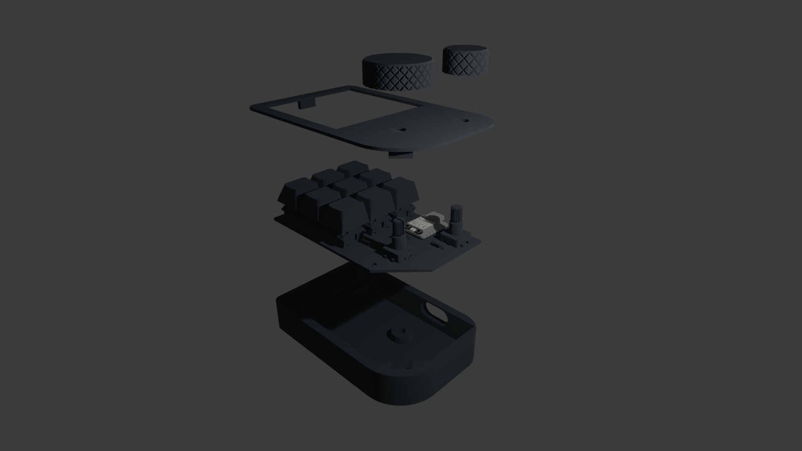

# FidgetPad V2.1

Keyboards are flat. Flat is boring. Why not add some turny things?

This is a 3x3 macropad with 2 rotary encoders that originally had an OLED screen before I realized that I could trade it in for a 3x3 keyboard instead of a 1x3 row.
It's meant to supplement my normal shitty keyboard which lacks a volume knob, something that I sorely miss.
Btw the git commit history is so empty because I had some large .blend files in my last repo that I just couldn't get rid of (so GitHub didn't let me push) :P

## BOM

| Item             | QNT |
| ---------------- | --- |
| MX Style Switchs | 9   |
| Keycaps          | 9   |
| 1N4148 Diode     | 9   |
| EC11 Encoders    | 2   |
| XIAO RP2040      | 1   |
| M3 Screws        | 2   |
| M3 Heat Insert   | 2   |
| PCB              | 1   |
| Case             | 1   |

## Images

It took a comical amount of time for me to realize that my schematic could be neat. Don't look at V1. Also turns out I didn't need pullup resistors on every single pin. Neat!

There are breakout pins for GND, +5V and +3V3 but I'm not sure if I want to use them. I put them there just in case I wanted to add some jank LEDs at any point in the future.

My 3D models disappeared :<

The PCB attaches to the case with 2 M3 screws. The lid should hopefully work without any screws.

wow grayscale, how captivating.

Blender is hard.

